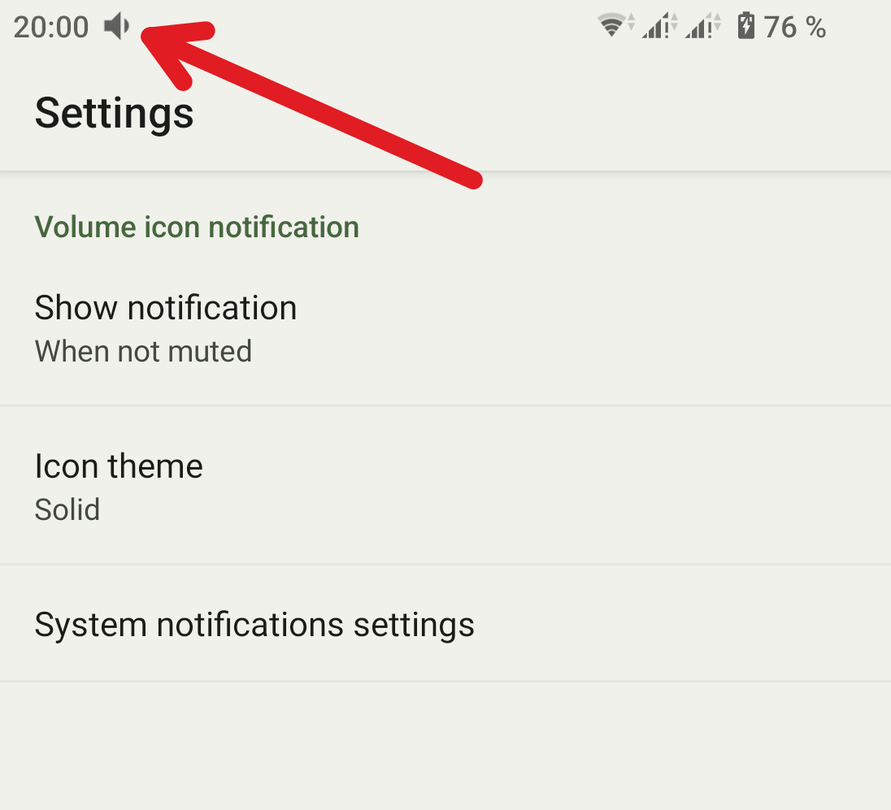

## VolumeIcon

Tiny (<100kB) Android app that show a volume icon in the status bar and provide some tweaks for
the volume control.

Application has no launcher icon and can be enabled and configured via **Settings → Accessibility**.

To enable the accessibility service for your newly installed app, follow these quick steps:

1. **Allow Settings:** Open Settings → Apps → find and select Volume Icon.
2. **Remove Restriction:** Tap the three dots in the top-right corner and select Allow restricted
   settings. Authenticate with your PIN or fingerprint.
3. **Enable Service:** Go back to Settings → Accessibility → select Volume Icon and turn the switch
   ON.